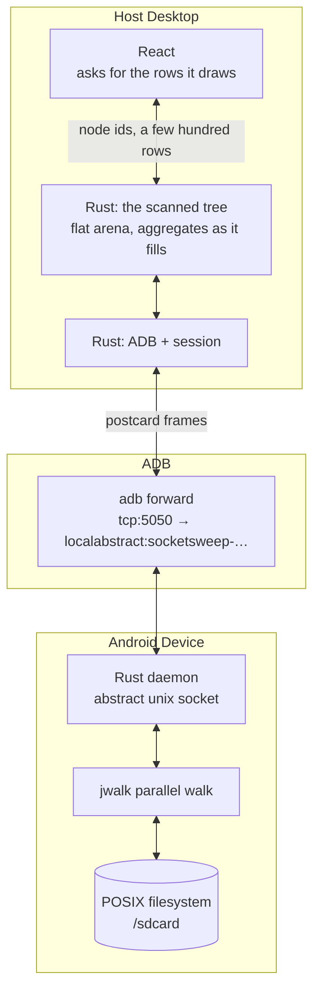
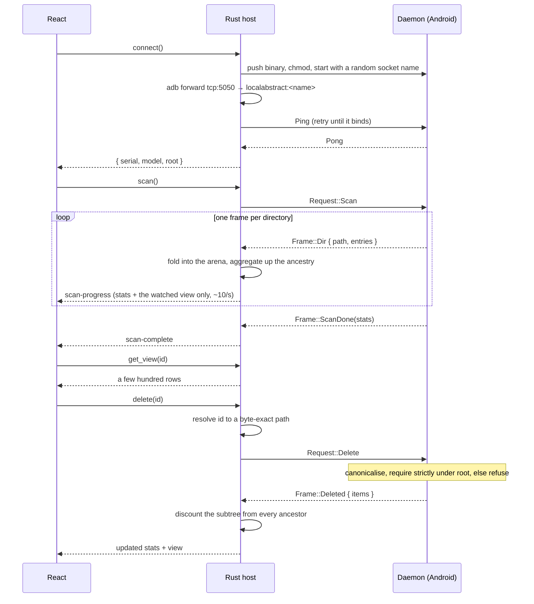

<div align="center">
  
  <h1>SocketSweep</h1>
  <p><strong>See what's eating your Android storage in seconds, not minutes.</strong></p>
  
  
  
  
  
  
  <br />
  <a href="https://github.com/sponsors/VishnuSrivatsava"></a>
</div>

<br />

<div align="center">
  <a href="https://youtu.be/ttsc6Xf6Xb4">
    
  </a>
  <br />
  <a href="https://youtu.be/ttsc6Xf6Xb4"><strong>▶ Watch the full demo and architecture breakdown</strong></a>
</div>

---

## 😤 The Problem

Ever plugged your Android phone into your PC to figure out what's eating all your storage?

Here's what happens with the standard USB connection (MTP):

- You open the phone in File Explorer / Finder
- Click on a folder with lots of files
- **"Calculating size..."** — hangs for 4+ minutes
- Eventually shows sizes, but navigating is painfully slow
- Trying to find large files? Good luck scrolling through hundreds of folders one by one

This is because **MTP (Media Transfer Protocol)** — the protocol your OS uses to talk to Android over USB — was designed in 2008 for MP3 players. It transfers file metadata one item at a time, with no caching, no parallel requests, and no way to do a fast recursive scan. It was never built for phones with 100GB+ of photos, videos, and apps.

**SocketSweep bypasses MTP entirely.**

---

## ⚡ How Fast?

Full `/sdcard` scan on a **Samsung Galaxy S24 Ultra (256GB)** with ~47,000 files:

> **~6-15 seconds** — full interactive treemap ready to explore. Best case was
> 6.9 seconds with a warm cache and minimal background activity; the spread
> comes from device load (background apps, media indexing, thermal state).

> [!NOTE]
> Those numbers were measured against the original single-threaded C++ engine.
> The daemon has since been rewritten in Rust with a parallel walk, and **has
> not been re-measured on hardware**. It should be faster — `/sdcard` sits
> behind a FUSE layer on Android 11+, so the walk is latency-bound and
> concurrency is exactly what helps — but until someone runs it on a real
> device that is a prediction, not a result. Treat the figures above as the
> floor, not the current performance.

For comparison, doing the same thing over MTP (plugging in the phone and browsing via Windows Explorer or Finder) typically involves minutes of "Calculating size..." freezes, and macOS Finder doesn't even show folder sizes at all.

*Proper side-by-side benchmarks against OpenMTP and other tools are coming soon.*

---

## 📸 What It Looks Like

<div align="center">
  
  
  <br />
  <p><em>Left: Connection Dashboard | Right: Interactive Treemap — click any block to drill down</em></p>
</div>

> [!NOTE]
> These screenshots predate the interface rewrite. The treemap is now the main
> canvas rather than a strip under the stat cards, it nests and drills down, the
> activity log is a collapsed drawer, and there are Largest Files and File Types
> views alongside search. Replacing them needs a device to scan.

---

## 🚀 How to Use

### 1. Download
**[Download SocketSweep v1.0.0](https://github.com/VishnuSrivatsava/SocketSweep/releases/tag/v1.0.0)**

> [!IMPORTANT]
> These are upstream's released binaries and they predate the rewrite described
> below — including the socket change in [Security](#-security). They are the
> right download if you just want the app today; they are not what this branch
> builds. There is no release of this branch yet.

| Platform | Download |
|----------|----------|
| 🪟 **Windows** | [Installer (.exe)](https://github.com/VishnuSrivatsava/SocketSweep/releases/tag/v1.0.0) · [Enterprise (.msi)](https://github.com/VishnuSrivatsava/SocketSweep/releases/tag/v1.0.0) |
| 🍎 **macOS** (Apple Silicon) | [Disk Image (.dmg)](https://github.com/VishnuSrivatsava/SocketSweep/releases/tag/v1.0.0) |
| 🐧 **Linux** | [AppImage](https://github.com/VishnuSrivatsava/SocketSweep/releases/tag/v1.0.0) · [.deb](https://github.com/VishnuSrivatsava/SocketSweep/releases/tag/v1.0.0) |

> **macOS note:** Since the build is ad-hoc signed, run this once after installing:
> ```bash
> xattr -cr /Applications/SocketSweep.app
> ```

### 2. Enable USB Debugging on your phone
Go to **Settings → About Phone → tap "Build Number" 7 times** to unlock Developer Options. Then go to **Settings → Developer Options → enable "USB Debugging"**.

### 3. Plug in and scan
1. Connect your phone via USB cable
2. Open SocketSweep
3. Click **Connect** — the app will automatically push the daemon to your phone and set everything up
4. Click **Scan** — your full storage treemap loads in seconds
5. Click on any block in the treemap to drill down. Found something huge you don't need? Delete it right from the app.

That's it. No apps to install on your phone, no Wi-Fi setup, no root required.

---

## 🧠 How It Works (The Short Version)

Instead of going through MTP, SocketSweep does something completely different:

1. **Pushes a tiny Rust program** (~400KB) to your phone via ADB
2. **That program walks the filesystem in parallel** using native POSIX calls — no MTP bottleneck. `/sdcard` sits behind a FUSE layer on Android 11+, so the walk is latency-bound and concurrency is what makes it fast
3. **Streams results back** directory by directory through the USB cable, so the desktop can start drawing before the walk finishes
4. **Renders an interactive treemap** in a React frontend so you can see what's taking space

The architecture was inspired by [scrcpy](https://github.com/Genymobile/scrcpy) — the "push a native binary via ADB, communicate over a local socket" pattern.

---

## 🏗 Architecture (For Developers)

SocketSweep has three layers:



Three properties worth calling out:

**The device socket is not a TCP port.** An abstract unix socket in the `shell`
SELinux domain is not reachable by installed apps, which loopback TCP is. The
daemon accepts a recursive delete, so that distinction matters.

**The tree lives on the desktop, not in React.** The frontend addresses nodes by
id and asks for the few hundred rows it is about to draw. Nothing proportional
to device size crosses the IPC boundary.

**Directory totals are aggregated on the host as frames arrive**, which is what
lets the UI show sizes climbing during a scan rather than waiting for a total.

### Interaction Lifecycle



---

## 🔒 Security

The daemon runs on your phone and can delete files, so how it is reached and
what it will act on both matter.

**It does not open a network port on the device.** The daemon binds an abstract
unix socket and the desktop reaches it through `adb forward
tcp:5050 localabstract:<random-name>`. Binaries under `/data/local/tmp` run in
the `shell` SELinux domain, which `untrusted_app` is denied `connectto` on — so
an installed app cannot reach it. Loopback TCP would be reachable by anything
holding `INTERNET`. The socket name is regenerated per session. This is the
arrangement scrcpy uses.

**The daemon validates deletes itself.** It canonicalises the target and
requires it to sit strictly beneath the session root, comparing whole path
components — so a `/sdcard/Down` root cannot authorise deleting
`/sdcard/Downloads`. Symlinks are judged by where they resolve, not where they
sit. The desktop deliberately does not police this: a check that lives only on
the host is one that anything talking to the socket directly never encounters.

**Known limitation.** There is a window between the check and the unlink in
which a path component could be swapped for a symlink. Closing it properly needs
an `openat`/`O_NOFOLLOW` descent; on a single-user device, where an attacker
would already need shell-domain access, it is not the weak link.

**Not yet verified on hardware.** The design above is implemented and unit
tested, but no part of it has run against a real phone. `adb shell ss -ltn |
grep 5050` returning nothing is the check that proves no TCP listener is
exposed.

---

## 🔧 Development Setup (Building from Source)

### Prerequisites
1. **Node.js** (v18+)
2. **Rust** (v1.70+ with Cargo)
3. **Android NDK** (v26d or newer) — only if you want to rebuild the device daemon

You do *not* need ADB on your `$PATH`. SocketSweep bundles its own copy, fetched
by `npm run setup` below.

### 1. Install dependencies and fetch ADB
```bash
npm install
npm run setup
```
`npm run setup` downloads Google's platform-tools for your OS and places `adb`
into `src-tauri/bin/`. That directory is deliberately not in git — it holds
~18MB of per-platform binaries. Re-run with `npm run setup -- --force` to update.

### 2. Run the App
```bash
npm run tauri dev
```
*Ensure your Android device is plugged in via USB and **USB Debugging** is enabled.*

### Rebuilding the device daemon (optional)
A prebuilt `src-tauri/bin/daemon` is checked in, so you only need the NDK if you
are changing the daemon itself:
```bash
npm run build:daemon
```
The script finds your NDK (or honours `ANDROID_NDK_HOME`), adds the Rust target
if missing, cross-compiles for `aarch64-linux-android` and installs the result.
One script for all three build hosts, replacing the three copies of the same
compiler invocation that used to live in `engine/build.sh` and two CI steps.

### Repository layout
```
crates/protocol/   wire types shared by daemon and host — one definition, no drift
crates/scanner/    parallel scan engine; portable, so it is tested without a phone
crates/daemon/     the Android binary: abstract socket, request loop, delete guard
src-tauri/         desktop host: ADB, the scanned tree, and the Tauri commands
src/               React frontend
```

The scan engine lives in its own crate specifically so `cargo test -p
socketsweep-scanner` exercises it against a temp directory on your machine. The
C++ engine it replaces could only be tested by pushing it to a device.

### Checks
```bash
npm run lint && npm run typecheck && npm test
cargo fmt --check && cargo clippy --workspace --all-targets -- -D warnings
```

---

## 🛠 Troubleshooting

### "0 Files" or Missing Folders on Android 11+
Android 11 introduced Scoped Storage, restricting file access. SocketSweep automatically tries to bypass this via:
```bash
adb shell appops set com.android.shell MANAGE_EXTERNAL_STORAGE allow
```
If scanning still shows nothing, check if your OEM requires extra toggles (e.g., Xiaomi needs "USB Debugging (Security settings)" enabled).

### Samsung Auto Blocker
If you're on a Samsung device and USB Debugging is greyed out, you probably have **Auto Blocker** enabled. Go to **Settings → Security → Auto Blocker** and turn it off. Auto Blocker disables USB Debugging entirely, so no ADB-based tool (including SocketSweep) will work with it on. It's off by default — you'd only have this issue if you manually turned it on.

### Daemon Fails to Start
If you get `Permission denied`, make sure the daemon is being pushed to `/data/local/tmp/`. Modern Android blocks execution from `/sdcard/`. SocketSweep handles this automatically.

---

## 💖 Support This Project

If SocketSweep saved you from the nightmare of MTP, consider supporting its development:

<div align="center">
  <a href="https://github.com/sponsors/VishnuSrivatsava"></a>
  &nbsp;&nbsp;
  <a href="https://paypal.me/mathcuber"></a>
</div>

---

## 📄 License

SocketSweep is released under the **GNU General Public License v3.0**. See the [LICENSE](LICENSE) file for more details.

---

## 👋 Author

Built by **Vishnu Srivatsava**. Inspired by the architecture of [scrcpy](https://github.com/Genymobile/scrcpy). Currently looking for Backend / Systems Engineering roles. Feel free to reach out on [LinkedIn](https://www.linkedin.com/in/vishnu-srivatsava-642222238/) or via [email](mailto:vishnusrivatsava@gmail.com).
